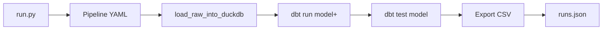


## Orchestrator run history

Last **10** runs from the repo `runs/runs.json`. **Runtime (s)** = full pipeline (load raw → dbt run/test → export CSV), not per model.

Update this page: `python run.py --runs-write` then `python run.py --docs` (or `--docs-serve`).

---

## LLD: Orchestrator flow (reference)

End-to-end steps for a single pipeline run (`python run.py <pipeline>`).
For **`--all`**, pipelines run in **topological order** from `config/pipelines/*.yaml` inputs (`pipeline_run_order`).

### Module call chain

`run.py` → `orchestrator.run_pipeline` → `dbt_run.run_dbt_pipeline` → `dbt_loader.load_raw_into_duckdb` + subprocess **dbt** → pandas export → `run_log.append_run`.

### Control flow (diagram)

### Ordered steps

1. **Resolve config** — `config/pipelines/<name>.yaml` (`transform.model`, `output`).
2. **Load raw** — `registry.yaml` → `CREATE OR REPLACE raw.*` in `warehouse.duckdb`.
3. **dbt run** — `dbt run --select <model>+` (builds model + upstream refs in selection).
4. **dbt test** — `dbt test --select <model>`.
5. **Export** — `SELECT *` from `main_staging` / `main_marts` for that model → CSV.
6. **Publish** — `data/curated/<output>/<run_id>.csv` and `latest.csv`.
7. **Log** — append to `runs/runs.json` (status, duration, `validation_summary`).

Full LLD (interfaces, data contracts): **`docs/LLD.md`**. **Interview diagrams** (many figures + talking points): **`docs/LLD_INTERVIEW.md`**.

---

| Run ID | Pipeline | Status | Runtime (s) | Started (UTC) | Finished (UTC) |
|--------|----------|--------|-------------|---------------|----------------|
| `20260506_174730_b2d1c275` | sales_by_brand_country | success | 16.234 | 2026-05-06T17:47:30.869719+00:00 | 2026-05-06T17:47:47.100250+00:00 |
| `20260506_174622_c1cf2ba2` | orders_enriched | success | 27.608 | 2026-05-06T17:46:22.865067+00:00 | 2026-05-06T17:46:50.480476+00:00 |
| `20260506_174518_5b5c2b99` | stg_orders | success | 27.102 | 2026-05-06T17:45:18.037444+00:00 | 2026-05-06T17:45:45.144655+00:00 |


