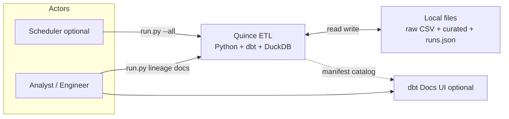
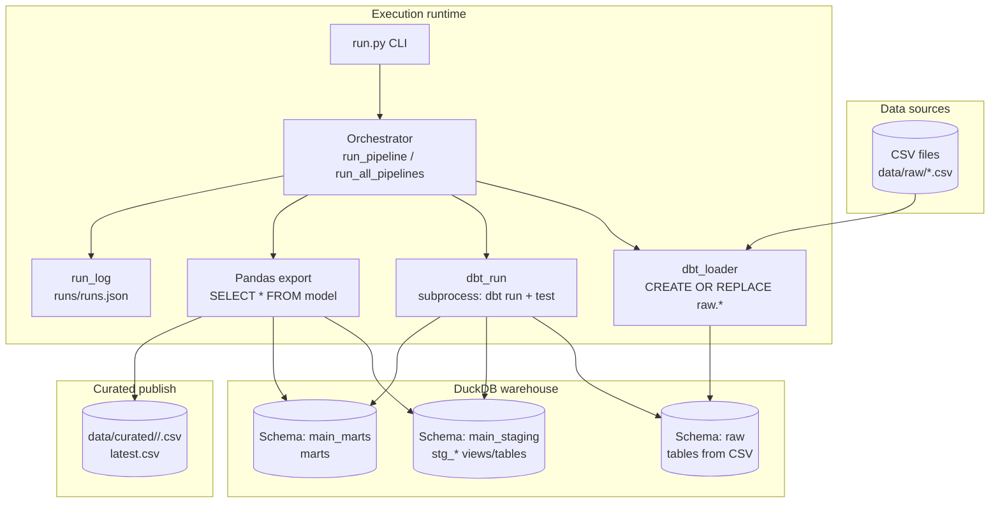
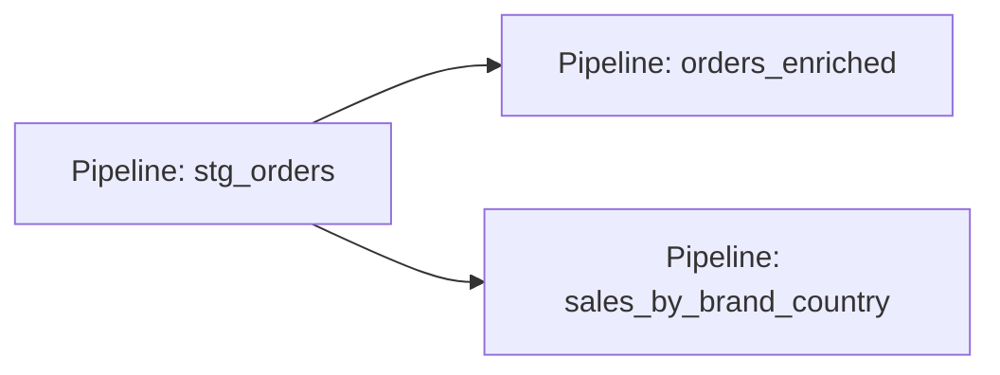
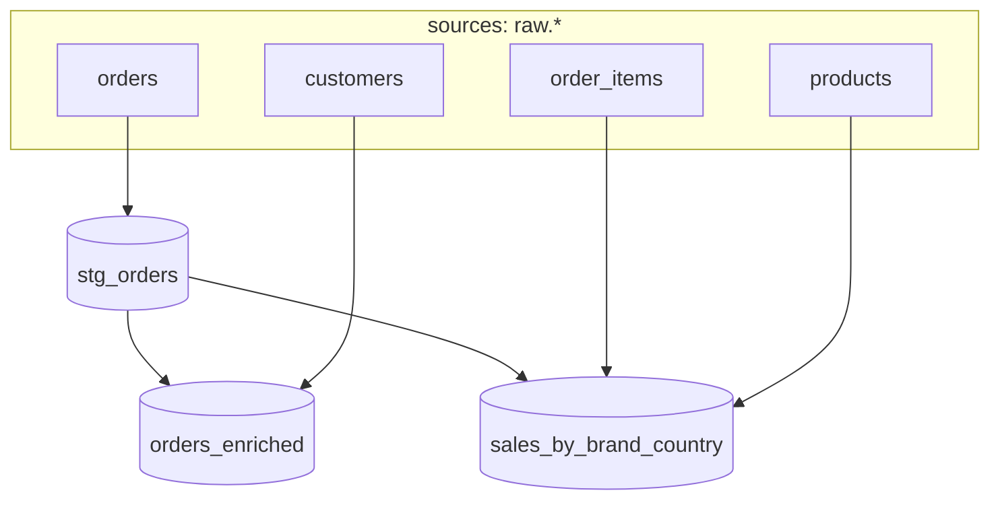
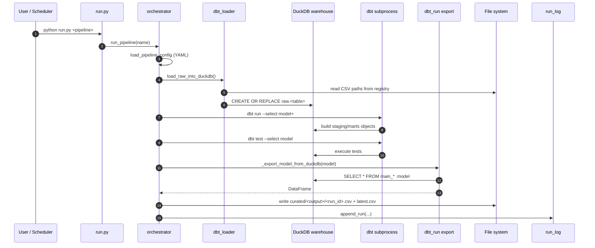
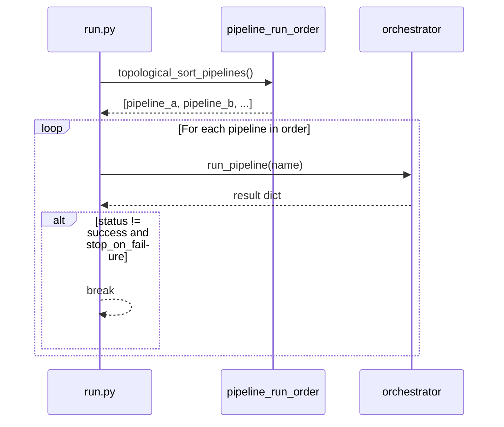

# Quince Demo — High Level Design (HLD) & Low Level Design (LLD)

**Purpose:** Submission-ready architecture documentation for the **self-serve ETL** (hybrid Python + dbt + DuckDB).  
**Scope:** Pipeline orchestration, data flow, module responsibilities, and key runtime sequences.

**Detailed LLD (modules, interfaces, data contracts, sequences):** see **`docs/LLD.md`**.

---

# Part A — High Level Design (HLD)

## A.1 System context

| Actor / System | Role |
|----------------|------|
| **Data producer** | Drops/updates CSV files under `data/raw/` (or equivalent). |
| **Analyst / engineer** | Runs `run.py`, inspects lineage, dbt docs, run history. |
| **Scheduler (optional)** | Invokes `python run.py --all` or single pipelines on a cadence. |
| **Quince ETL application** | Loads raw → DuckDB, runs dbt, exports curated CSVs, logs runs. |

**Single physical database:** one DuckDB file (`data/warehouse.duckdb`) shared by the loader and dbt.



*(Works in Mermaid Live, GitHub, many Markdown viewers.)*

---

## A.2 Logical architecture (containers & data flow)



**HLD narrative (one paragraph):**  
Raw CSVs are registered in `config/registry.yaml`. Each pipeline run (single or `--all`) invokes the **loader** to refresh `raw.*` tables in DuckDB, then **dbt** builds/refreshes models (`stg_*`, marts) per `dbt run --select <model>+`. **Tests** run via `dbt test --select <model>`. The **export** step reads the target model from DuckDB into a DataFrame and writes **versioned** CSV plus **`latest.csv`**. Every run is appended to **`runs/runs.json`** with timing and validation summary.

---

## A.3 Hybrid split of responsibilities

| Layer | Technology | Responsibility |
|-------|------------|------------------|
| **Ingestion** | Python + DuckDB | Discover raw datasets, `CREATE OR REPLACE` into `raw` schema. |
| **Transform & test** | dbt (duckdb adapter) | SQL models, `ref()`, `source()`, generic tests in `schema.yml`. |
| **Orchestration & publish** | Python | CLI, dependency order for `--all`, CSV export, run logging, lineage docs. |
| **Metadata (pipelines)** | YAML | Pipeline ↔ dbt model mapping, inputs for lineage / topological sort. |

---

## A.4 Pipeline dependency view (orchestration, not dbt-only)

Edges come from **`inputs`** in `config/pipelines/*.yaml` when an input dataset’s **`produced_by`** is another pipeline (from lineage graph).



**Note:** `dbt` has its own DAG via `ref()` / `source()`; this graph is for **Python execution order** when using `run.py --all`.

---

## A.5 dbt model DAG (transformation logic)



---

## A.6 Non-functional considerations (HLD)

| Concern | Approach in this design |
|---------|-------------------------|
| **Idempotency** | Each run gets new `run_id`; curated folder has immutable `run_id` artifact + `latest.csv`. |
| **Observability** | `runs/runs.json`, optional `docs/RUN_HISTORY.md`, dbt `run_results.json` parsed into validation summary. |
| **Concurrency** | Single DuckDB file: sequential `run.py --all` avoids writer contention; parallel fan-out is a future concern. |
| **Docs** | dbt Docs + optional lineage HTML/Markdown from `run.py --lineage-write`. |

---

# Part B — Low Level Design (LLD)

## B.1 Repository layout (implementation map)

```
quince_demo/
├── run.py                      # CLI entrypoint
├── config/
│   ├── registry.yaml           # Raw dataset → path, type: raw
│   └── pipelines/*.yaml        # Pipeline: transform.model, output, inputs
├── data/
│   ├── raw/                    # Input CSVs
│   ├── warehouse.duckdb        # DuckDB file (dbt + loader)
│   └── curated/<output>/       # Published CSVs per pipeline
├── dbt_project/
│   ├── profiles.yml            # duckdb path from QUINCE_DUCKDB_PATH
│   ├── dbt_project.yml         # model paths, schema routing (staging/marts)
│   ├── models/
│   │   ├── sources.yml         # Declares raw sources
│   │   ├── staging/            # stg_* models
│   │   └── marts/              # Business marts (incl. incremental example)
│   ├── macros/                 # e.g. exclude_cancelled
│   └── analyses/               # e.g. pipeline_runs for dbt Docs
├── runs/runs.json              # Append-only run log (JSON array)
└── src/
    ├── orchestrator.py         # run_pipeline, run_all_pipelines
    ├── dbt_run.py              # load → dbt run → dbt test → export DF
    ├── dbt_loader.py           # load_raw_into_duckdb
    ├── pipeline_config.py      # Load YAML pipeline config
    ├── pipeline_run_order.py   # Topological sort for --all
    ├── lineage.py              # Graph for CLI lineage / docs
    ├── run_log.py              # append_run, paths
    └── run_history_doc.py      # Markdown for RUN_HISTORY / dbt docs embed
```

---

## B.2 Module responsibilities (LLD)

| Module | Key functions | Inputs / outputs |
|--------|---------------|------------------|
| **run.py** | `main()`, CLI routing | argv → exit code; calls orchestrator, lineage, docs helpers |
| **orchestrator.run_pipeline** | End-to-end single pipeline | pipeline name → `{run_id, status, validation_summary, output_path, ...}` |
| **orchestrator.run_all_pipelines** | Ordered multi-pipeline | topological order → list of results; stops on failure (configurable) |
| **dbt_loader.load_raw_into_duckdb** | Raw ingest | registry → `warehouse.duckdb`, schema `raw` |
| **dbt_run.run_dbt_pipeline** | dbt + export | model name → `(success, DataFrame\|None, validation_summary)` |
| **pipeline_run_order.topological_sort_pipelines** | DAG sort | pipeline YAML lineage → ordered pipeline names |
| **run_log.append_run** | Persistence | run metadata → `runs/runs.json` |

---

## B.3 Single pipeline — sequence diagram (LLD)



---

## B.4 `run.py --all` — sequence diagram (LLD)



**Algorithm (topological sort):**  
Build directed edges: pipeline **Q** depends on **P** if **Q** lists an input dataset whose **`produced_by`** (from lineage) is **P**. Kahn’s algorithm; cycle → error.

---

## B.5 dbt invocation contract (LLD)

| Step | Command (conceptual) | Working directory | Environment |
|------|----------------------|-------------------|-------------|
| Run upstream models | `dbt run --select <model_name>+` | `dbt_project/` | `QUINCE_DUCKDB_PATH`, `DBT_PROFILES_DIR` |
| Test model | `dbt test --select <model_name>` | same | same |

**Profiles:** `dbt_project/profiles.yml` uses `env_var('QUINCE_DUCKDB_PATH')` so Python pins the warehouse path per run.

**Export resolution:** Try schemas `main_staging`, `main_marts` (and fallbacks) for `"<schema>"."<model_name>"`.

---

## B.6 Configuration schemas (LLD — conceptual)

**registry.yaml**

- `datasets.<name>.path` — relative path to file  
- `datasets.<name>.type` — `raw` → loaded by `dbt_loader`

**pipelines/<name>.yaml**

- `inputs` — list of **dataset** names (lineage + topological sort)  
- `transform.type` — `dbt`  
- `transform.model` — dbt model name (must match `dbt_project/models`)  
- `output` — curated folder name under `data/curated/`

---

## B.7 Data persistence (LLD)

| Artifact | Format | Semantics |
|----------|--------|-----------|
| `data/warehouse.duckdb` | DuckDB | Single file DB; `raw`, `main_staging`, `main_marts` (names per dbt/duckdb) |
| `data/curated/<output>/<run_id>.csv` | CSV | Immutable output per run |
| `data/curated/<output>/latest.csv` | CSV | Pointer-style “current” for consumers |
| `runs/runs.json` | JSON array | Audit: run_id, pipeline, status, duration, validation_summary, paths |

---

## B.8 Validation path (LLD)

1. **dbt test** writes/updates `dbt_project/target/run_results.json` (after test invocation).  
2. **dbt_run** reads `results[]` and maps to `validation_summary.results[]` with `passed`, `message`, `severity`.  
3. **Orchestrator** sets pipeline `failed` if dbt run fails, tests fail, or export fails; logs to `runs.json`.

---

## B.9 Extension points (for future LLD updates)

| Change | Touch points |
|--------|----------------|
| New raw file | `registry.yaml`, `sources.yml`, loader (automatic if registered) |
| New dbt model | `dbt_project/models/**`, `schema.yml`, new `config/pipelines/*.yaml` |
| Incremental mart | Model SQL `config()` + incremental filter; optional `--full-refresh` ops |
| Scheduler | External cron/launchd/Airflow calling `run.py --all` |

---

## B.10 Diagram checklist for presentation slides

**HLD slides suggested:**  
1) Context (actors + Quince + files)  
2) Container diagram (A.2)  
3) Hybrid layers table (A.3)  
4) Pipeline order vs dbt DAG (A.4 + A.5)

**LLD slides suggested:**  
1) Directory map (B.1)  
2) Single-pipeline sequence (B.3)  
3) `--all` sequence + topsort (B.4)  
4) dbt + env contract (B.5)  
5) Persistence table (B.7)

**Export:** Copy Mermaid blocks into [Mermaid Live](https://mermaid.live), Notion, or VS Code Mermaid preview; export PNG/SVG for PowerPoint/Google Slides.

---

*Document version: aligned with Quince demo hybrid ETL (Python orchestration + dbt-duckdb + CSV publish).*
