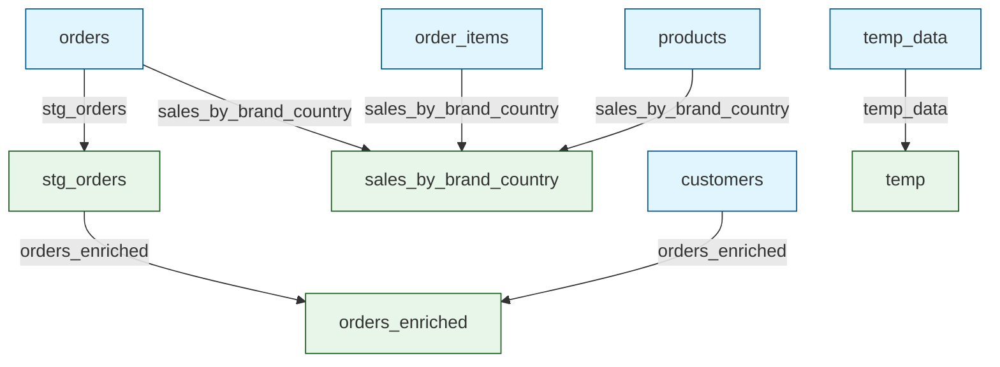

# Pipeline lineage (graph)

Generated from `config/pipelines/*.yaml`. Edges show **which pipeline** moves data from input dataset → output dataset.

Re-generate: `python run.py --lineage-write`

```mermaid
flowchart TB

    classDef raw fill:#e1f5fe,stroke:#01579b;
    classDef curated fill:#e8f5e9,stroke:#1b5e20;

    n_customers["customers"]
    class n_customers raw
    n_order_items["order_items"]
    class n_order_items raw
    n_orders["orders"]
    class n_orders raw
    n_orders_enriched["orders_enriched"]
    class n_orders_enriched curated
    n_products["products"]
    class n_products raw
    n_sales_by_brand_country["sales_by_brand_country"]
    class n_sales_by_brand_country curated
    n_stg_orders["stg_orders"]
    class n_stg_orders curated
    n_temp["temp"]
    class n_temp curated
    n_temp_data["temp_data"]
    class n_temp_data raw

    n_stg_orders -->|orders_enriched| n_orders_enriched
    n_customers -->|orders_enriched| n_orders_enriched
    n_orders -->|sales_by_brand_country| n_sales_by_brand_country
    n_order_items -->|sales_by_brand_country| n_sales_by_brand_country
    n_products -->|sales_by_brand_country| n_sales_by_brand_country
    n_orders -->|stg_orders| n_stg_orders
    n_temp_data -->|temp_data| n_temp
```
