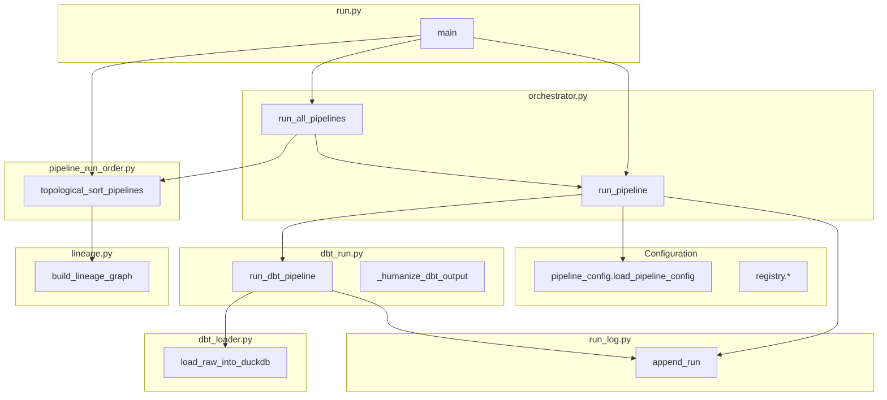
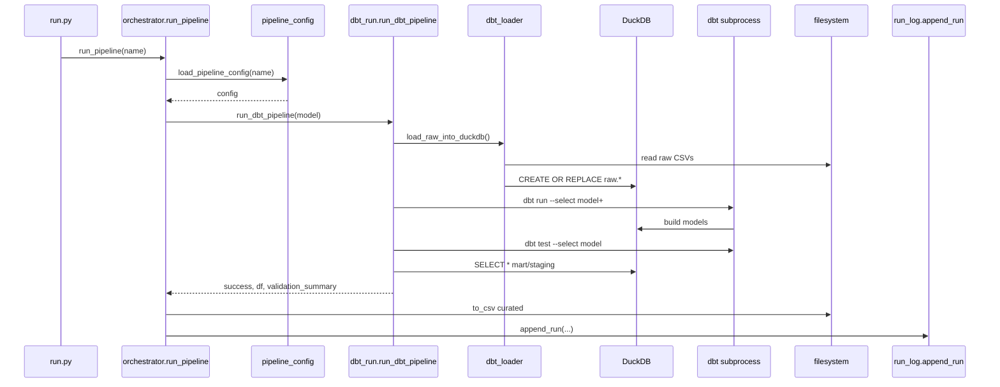
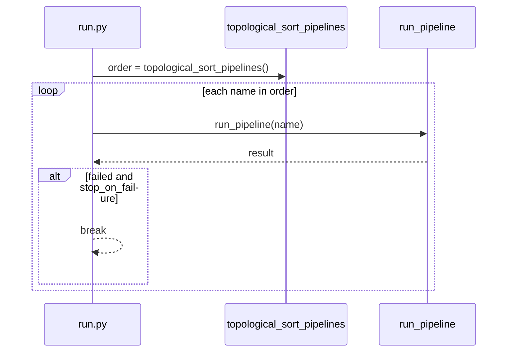

# Low Level Design (LLD) — Quince self-serve ETL

This document is the **LLD** companion to **`HLD_LLD.md`** (HLD + overview) and **`hld_quince_etl_reference.png`**. It describes **modules, interfaces, control flow, and data contracts** so engineers can implement or extend the system safely.

**Interview / presentation — detailed LLD diagrams (multiple Mermaid figures + talking points):** **`docs/LLD_INTERVIEW.md`**.

**Generated docs:** a shorter **LLD flow** (Mermaid + numbered steps) is embedded in **`docs/RUN_HISTORY.md`** and **`dbt_project/docs/pipeline_runs.md`** whenever you run `python run.py --runs-write` or `--docs-write` (source: `src/lld_flow_doc.py`).

---

## 1. What “good LLD” means here

| Layer | What to document |
|--------|------------------|
| **Components** | Python packages/modules and **who calls whom** (dependency direction). |
| **Interfaces** | Public function signatures, **inputs/outputs**, and **failure modes**. |
| **Control flow** | **Sequence** of steps for one pipeline run and for `--all`. |
| **Data contracts** | Shape of **`runs.json`** records and **`validation_summary`**. |
| **External systems** | **dbt** CLI contract, **DuckDB** paths/schemas, **env vars**. |

**Best practice:** Keep **one LLD per bounded context**. This repo’s bounded context is **“orchestrate load → dbt → export → log”**; dbt’s internal SQL is documented in **`dbt_project/`** (`schema.yml`, model files).

---

## 2. Logical component diagram (Python runtime)



**Dependency rule:** `run.py` → `orchestrator` → `dbt_run` / `pipeline_config` / `run_log`. **`lineage`** is used for ordering and CLI docs, not for executing SQL.

---

## 3. Module reference (file → responsibility)

| Path | Responsibility |
|------|----------------|
| **`run.py`** | CLI routing: `run_pipeline`, `--all`, lineage, docs, `--runs`, etc. |
| **`src/orchestrator.py`** | **`run_pipeline`**: config load → `run_dbt_pipeline` → CSV write → `append_run`. **`run_all_pipelines`**: topological order, stop on failure. |
| **`src/dbt_run.py`** | Load raw, subprocess **`dbt run --select model+`**, **`dbt test --select model`**, parse `run_results.json`, DuckDB **SELECT *** export to DataFrame, humanize errors. |
| **`src/dbt_loader.py`** | **`load_raw_into_duckdb`**: registry-driven **`CREATE OR REPLACE`** `raw.<dataset>`. |
| **`src/pipeline_config.py`** | Load/validate **`config/pipelines/<name>.yaml`** (dbt-only transform). |
| **`src/registry.py`** | Project root resolution, **`registry.yaml`** load, dataset paths. |
| **`src/pipeline_run_order.py`** | **`topological_sort_pipelines`** from lineage edges. |
| **`src/lineage.py`** | Build graph from pipeline YAMLs; text/Mermaid/docs output. |
| **`src/run_log.py`** | Append JSON records to **`runs/runs.json`**. |
| **`src/run_history_doc.py`** | Generate Markdown for run history / dbt Docs embed. |

---

## 4. Core interface: `run_pipeline`

### Signature (conceptual)

`run_pipeline(pipeline_name: str, project_root?: Path) -> dict`

### Return dict (success path)

| Key | Type | Meaning |
|-----|------|---------|
| `run_id` | str | UTC timestamp + short UUID |
| `status` | `"success"` \| `"failed"` | End state |
| `validation_summary` | dict | See §6 |
| `output_path` | str | Relative path to versioned CSV under `data/curated/` |
| `duration_seconds` | float | Wall time |

### Control flow (ordered steps)

1. **`load_pipeline_config`** — fail → log failed run, return.
2. **`transform.type`** must be **`dbt`** — else fail.
3. **`run_dbt_pipeline(model_name)`** where `model_name = transform.model`.
4. If dbt fails → **`append_run`** failed → return.
5. If tests fail (`all_critical_passed` false) → failed run → return.
6. Write **`data/curated/<output>/<run_id>.csv`** and **`latest.csv`**.
7. **`append_run`** success.

### Side effects

- **`data/warehouse.duckdb`** mutated by loader + dbt.
- **`runs/runs.json`** appended.
- Curated CSVs written.

---

## 5. Core interface: `run_dbt_pipeline`

### Inputs

- **`model_name`**: dbt model name (must match `dbt_project/models/**` and pipeline YAML).

### Steps (strict order)

1. **`load_raw_into_duckdb`** → path to warehouse.
2. Set **`QUINCE_DUCKDB_PATH`**, **`DBT_PROFILES_DIR`** (dbt project dir).
3. **`dbt --no-use-colors run --select <model_name>+`** (downstream dbt nodes included).
4. On non-zero exit: return failure + **`_humanize_dbt_output(stderr|stdout)`**.
5. **`dbt --no-use-colors test --select <model_name>`**.
6. Read **`dbt_project/target/run_results.json`** → build **`validation_summary.results`** (rule = `unique_id`, passed, message).
7. If tests failed and no parsed results: humanized stderr.
8. **`_export_model_from_duckdb(warehouse, model_name)`** — try schemas **`main_staging`**, **`main_marts`**, then fallbacks.

### Failure modes

| Condition | Returned |
|-----------|----------|
| dbt run fails | `success=False`, `validation_summary` with `dbt_run` message |
| dbt test fails | `success=False` or `all_critical_passed=False` |
| Model table missing | `export_error` |

---

## 6. Data contract: `validation_summary`

```json
{
  "all_critical_passed": true,
  "results": [
    {
      "rule": "test.quince.not_null_orders_enriched_order_id....",
      "passed": true,
      "message": "",
      "severity": "critical"
    }
  ],
  "export_error": "optional string when DuckDB export throws"
}
```

- **`rule`**: From dbt **`unique_id`** for tests; **`dbt_run`** / **`dbt_test`** for subprocess failures.
- **`message`**: Humanized (no ANSI); see **`_humanize_dbt_output`** in `dbt_run.py`.

---

## 7. Data contract: `runs/runs.json` record

Each entry is a JSON object (array append):

| Field | Required | Description |
|-------|----------|-------------|
| `run_id` | yes | Unique run id |
| `pipeline` | yes | Pipeline name (YAML stem) |
| `status` | yes | `success` / `failed` |
| `validation_summary` | optional | As §6 |
| `output_path` | optional | Relative curated path |
| `error` | optional | Short error string on failure |
| `started_at`, `finished_at` | optional | ISO timestamps |
| `duration_seconds` | optional | Float |

**Concurrency note:** single process appends to one file; parallel runs could corrupt JSON — **not supported** without file locking.

---

## 8. Sequence: single pipeline (`python run.py <name>`)



---

## 9. Sequence: `python run.py --all`



**Algorithm:** **`pipeline_run_order`**: for each pipeline’s **`inputs`**, if dataset **`produced_by`** equals another pipeline, add edge **producer → consumer**; Kahn topological sort; cycle → **`ValueError`**.

---

## 10. Configuration contracts

### `config/registry.yaml`

- **`datasets.<name>.path`**: relative to project root.
- **`type: raw`**: included in **`load_raw_into_duckdb`**.

### `config/pipelines/<name>.yaml`

| Key | Required | Notes |
|-----|----------|--------|
| `output` | yes | Curated folder name: `data/curated/<output>/` |
| `transform.type` | yes | Must be `dbt` |
| `transform.model` | yes | dbt model name |
| `inputs` | optional | Lineage + topological sort only |

---

## 11. External interfaces

| System | Interface |
|--------|-----------|
| **dbt** | CLI: `dbt run`, `dbt test`, `dbt docs`; **`--project-dir`** = `dbt_project/` when cwd is repo root. |
| **DuckDB** | File: **`QUINCE_DUCKDB_PATH`**; schemas **`raw`**, **`main_staging`**, **`main_marts`** (adapter-dependent names). |
| **profiles.yml** | **`path: "{{ env_var('QUINCE_DUCKDB_PATH') }}"`**. |

---

## 12. LLD views checklist (for reviews / draw.io)

Use **separate mini-diagrams**:

1. **Component diagram** — §2 (Python modules).
2. **Sequence** — §8 (single run).
3. **Sequence** — §9 (`--all`).
4. **State** — success vs failed branches in **`run_pipeline`** (optional state machine slide).
5. **Data** — §6–7 (JSON shapes).

---

## 13. Relation to HLD

| HLD | LLD |
|-----|-----|
| “What are the big boxes?” | “Which `.py` file implements each box?” |
| “What is the business flow?” | “Exact call order and subprocess commands.” |
| “Where does data land?” | **`runs.json` fields**, curated paths, DuckDB schemas. |

---

## 14. References

- **`docs/HLD_LLD.md`** — Mermaid HLD + original LLD outline.
- **`docs/HLD_DRAWIO_BLUEPRINT.md`** — draw.io HLD layout.
- **`dbt_project/dbt_project.yml`**, **`models/**`**, **`schema.yml`** — transform LLD inside dbt.

---

*LLD version: aligned with hybrid Python orchestration + dbt-duckdb in this repository.*
