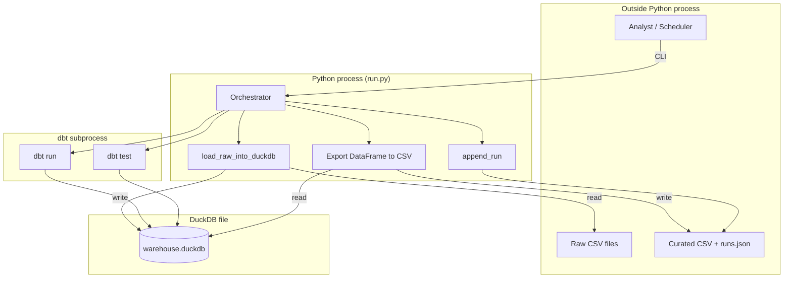
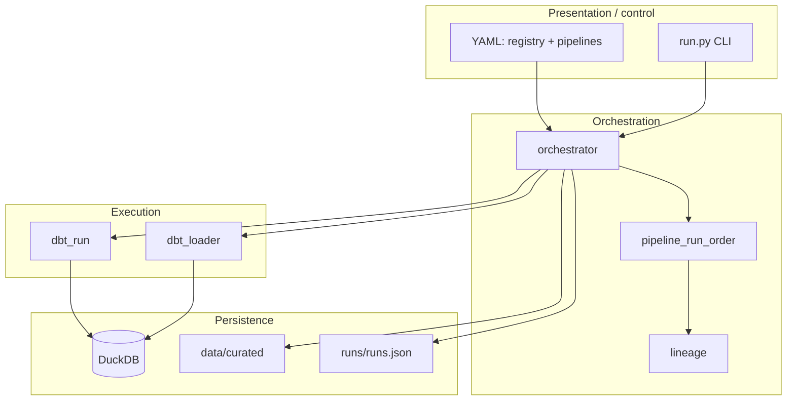
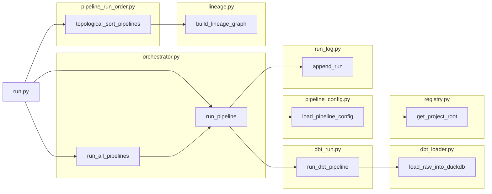
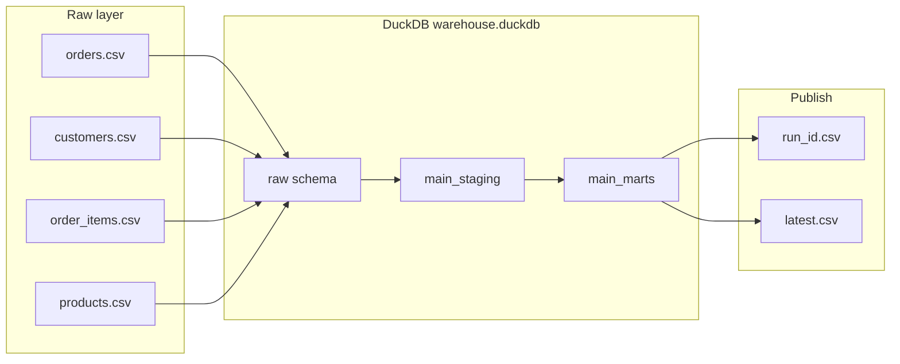
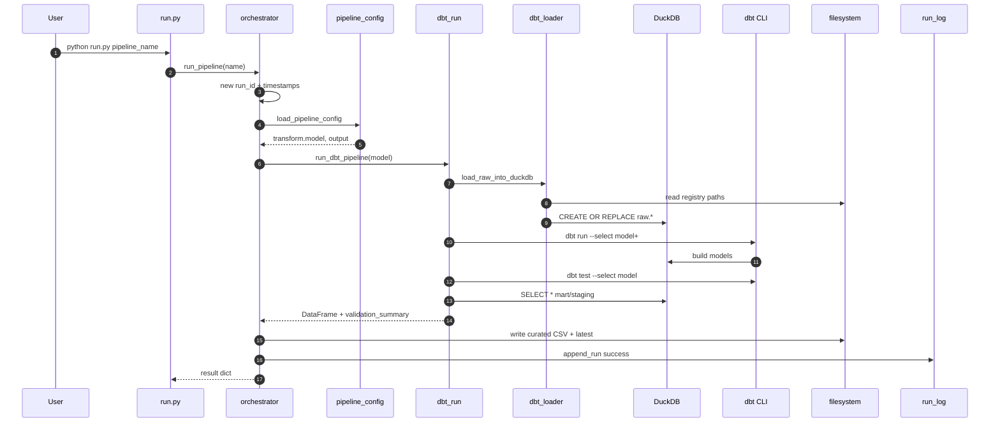
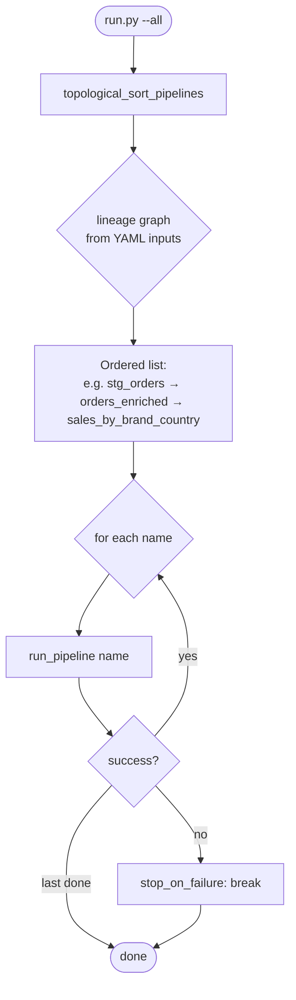
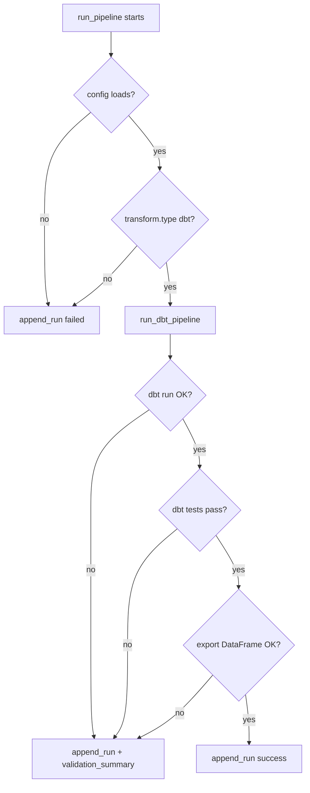
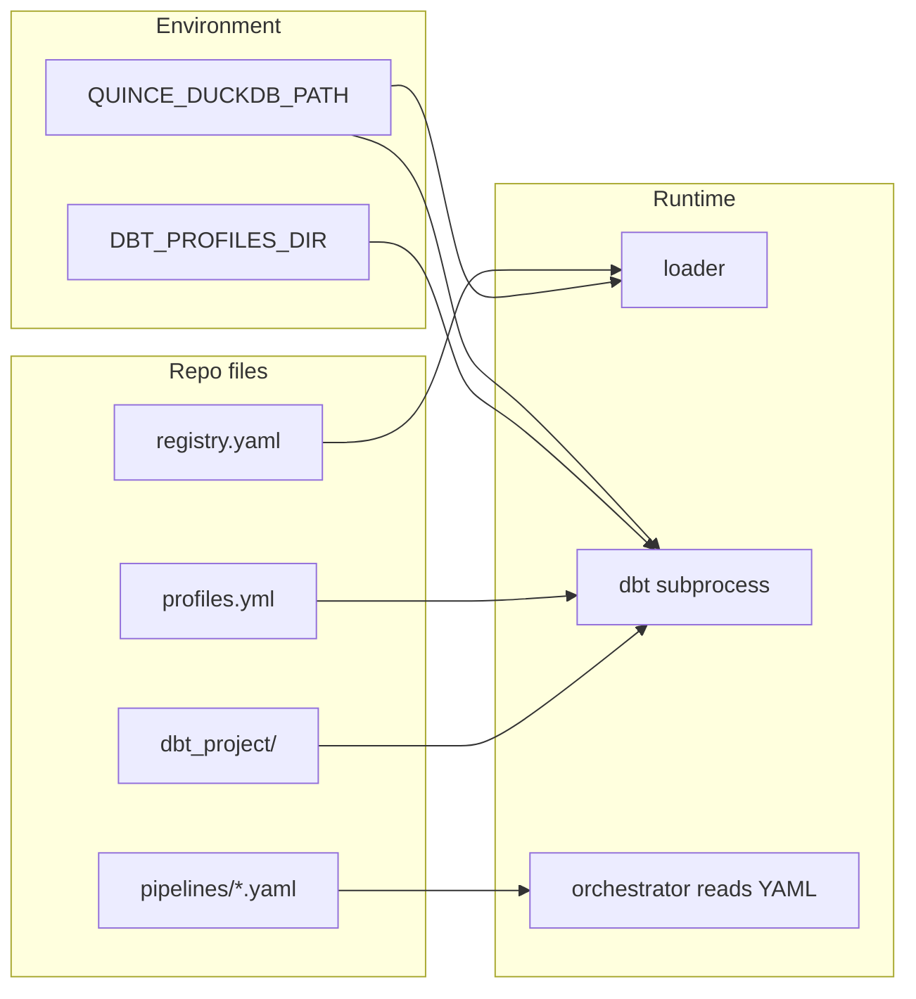

# LLD — Detailed diagrams for interviews (Quince self-serve ETL)

Use this document for **technical interviews** and **design reviews**. It expands **`docs/LLD.md`** with **multiple Mermaid diagrams** you can paste into [Mermaid Live](https://mermaid.live), Notion, or export as PNG/SVG for slides.

**How to present (suggested order):**
1. **§1** — Process boundary (who does what).  
2. **§4** — Data plane (where data lives).  
3. **§5** — Single pipeline sequence (end-to-end).  
4. **§6** — `run.py --all` + dependency order.  
5. **§7** — Failure paths (show you think about ops).  
6. **§8** — Config + env (contract with dbt/DuckDB).

---

## How to view this LLD in a structured way

| Method | Steps |
|--------|--------|
| **Outline (recommended)** | **Cursor / VS Code** → open `docs/LLD_INTERVIEW.md` → left **Explorer** → **Outline** (headings tree). Click any section to jump. |
| **Go to Symbol in Editor** | **`Cmd+Shift+O`** (Mac) or **`Ctrl+Shift+O`** (Win/Linux) → type e.g. `5.` or `Sequence` → select heading → Enter. |
| **Markdown Preview** | **`Cmd+Shift+V`** / **`Ctrl+Shift+V`**. For **Mermaid** in preview, install extension **Markdown Preview Mermaid Support**. |
| **Jump links below** | Use the **[Table of contents](#lld-toc)** — links use stable anchors (`#lld-1` … `#lld-12`). |

---

## At-a-glance (all sections)

| § | What you’ll show | Diagram / format |
|---|------------------|------------------|
| [1](#lld-1) | Python vs dbt subprocess vs files | Flowchart |
| [2](#lld-2) | Control → orchestration → execution layers | Flowchart |
| [3](#lld-3) | `src/` module dependency graph | Flowchart |
| [4](#lld-4) | CSV → `raw` → staging → marts → curated | Flowchart |
| [5](#lld-5) | Single pipeline, numbered sequence | Sequence |
| [6](#lld-6) | `run.py --all` + topological sort | Flowchart |
| [7](#lld-7) | Failure / decision paths | Flowchart |
| [8](#lld-8) | Env vars + YAML + `profiles.yml` | Flowchart |
| [9](#lld-9) | Observability artifacts | Table |
| [10](#lld-10) | Trade-offs (Q&A) | Table |
| [11](#lld-11) | Export diagrams to slides | Steps |
| [12](#lld-12) | Related docs | Table |

---

## Table of contents (jump links)

1. [Process boundary & external systems](#lld-1)  
2. [Layered architecture (control vs data)](#lld-2)  
3. [Module dependency graph (detailed)](#lld-3)  
4. [Data plane — files → schemas → export](#lld-4)  
5. [Sequence — single pipeline (`run_pipeline`)](#lld-5)  
6. [`run.py --all` + topological order](#lld-6)  
7. [Failure & decision paths](#lld-7)  
8. [Configuration & environment contract](#lld-8)  
9. [Observability artifacts](#lld-9)  
10. [Trade-offs (good for interview Q&A)](#lld-10)  
11. [Export for slides](#lld-11)  
12. [Related docs](#lld-12)  

---

## 1. Process boundary & external systems

Shows the **Python process** vs **subprocess** vs **filesystem**.

**Talking point:** *“One orchestrator coordinates load; dbt runs as a subprocess with the same DuckDB path; we don’t embed SQL in Python.”*

---

## 2. Layered architecture (control vs data)

**Talking point:** *“Config is declarative; orchestration is Python; dbt owns SQL; DuckDB is the single warehouse.”*

---

## 3. Module dependency graph (detailed)

Maps **files under `src/`** to call direction.

**Talking point:** *“`run_all_pipelines` only calls `run_pipeline` in sorted order; lineage is only for DAG edges, not SQL execution.”*

---

## 4. Data plane — files → schemas → export

**Talking point:** *“Loader materializes `raw.*`; dbt builds staging and marts; export reads the **final model** table for that pipeline’s `transform.model`.”*

---

## 5. Sequence — single pipeline (`run_pipeline`)

Detailed step order (matches **`src/orchestrator.py`** + **`src/dbt_run.py`**).

**Talking point:** *“Each pipeline is one `run_id`; failure is logged at any step with the same `run_id`.”*

---

## 6. `run.py --all` + topological order

**Talking point:** *“Edges come from **dataset produced_by** in lineage: if mart lists `stg_orders` as input, staging runs first. This is **orchestration order**, separate from dbt’s internal DAG.”*

---

## 7. Failure & decision paths

**Talking point:** *“We always try to persist failure to `runs.json` with `validation_summary` from dbt when available.”*

---

## 8. Configuration & environment contract

**Talking point:** *“`QUINCE_DUCKDB_PATH` pins the same file for Python and dbt; `DBT_PROFILES_DIR` points at the folder containing `profiles.yml`.”*

---

## 9. Observability artifacts

| Artifact | Produced by | Purpose |
|----------|-------------|---------|
| `runs/runs.json` | `run_log.append_run` | Audit: status, duration, validation |
| `dbt_project/target/run_results.json` | dbt | Parsed into `validation_summary` |
| `data/curated/.../<run_id>.csv` | pandas `to_csv` | Immutable run output |
| `data/curated/.../latest.csv` | same | Consumer “current” pointer |

---

## 10. Trade-offs (good for interview Q&A)

| Topic | Choice | Why |
|-------|--------|-----|
| **Hybrid ETL** | Python + dbt | Self-serve YAML pipelines + tested SQL; avoid duplicating transform logic in Python |
| **Single DuckDB file** | Simplicity | Demo/local; production might separate raw vs serve or use warehouse |
| **`dbt run --select model+`** | Pulls upstream | One CLI call per pipeline; may rebuild shared nodes across pipelines |
| **CSV publish** | Portability | Easy handoff; Parquet/Delta for scale later |

---

## 11. Export for slides

1. Open [mermaid.live](https://mermaid.live).  
2. Paste a diagram block.  
3. **Actions → PNG/SVG**.  
4. Or use **draw.io** → Arrange → Insert → Advanced → **Mermaid** (if available).

---

## 12. Related docs

| Doc | Use |
|-----|-----|
| **`docs/LLD.md`** | Full LLD text: interfaces, JSON contracts |
| **`docs/HLD_LLD.md`** | HLD + overview |
| **`docs/HLD_DRAWIO_BLUEPRINT.md`** | draw.io HLD layout |

---

*Quince demo — hybrid self-serve ETL (Python orchestration + dbt-duckdb).*
